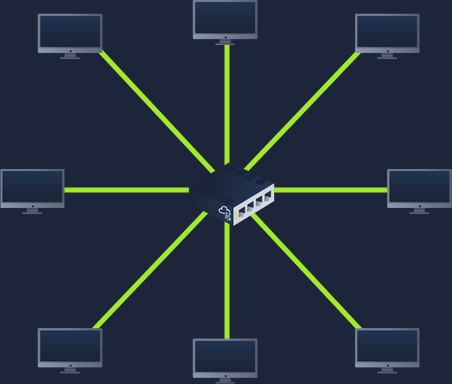

Learn about some of the technologies and designs that power private networks

---
## Introducing LAN Topologies

In reference to networking, when we refer to the term "topology", we are actually referring to the design or look of the network at hand. Let's discuss the advantages and disadvantages of these topologies below.

#### Star Topology

The main premise of a star topology is that devices are **individually connected to a central networking device such as a switch or hub**. This topology is the most common today because of its reliability and scalability, despite the higher cost.  

It is more expensive because it requires additional cabling and dedicated networking equipment. However, it offers significant advantages: it is highly scalable, making it easy to add new devices as demand grows. On the other hand, it requires more maintenance to keep the network functional.

#### Bus Topology

This topology relies on a single connection known as the backbone cable. It can be compared to a tree, where devices (leaves) branch off from the main cable. However, this design creates a bottleneck: all data travels along the same route, making troubleshooting difficult because it is hard to identify which device is causing issues.  

A major disadvantage is that if the backbone cable fails, all connected devices lose the ability to send or receive data across the bus.

#### Ring Topology

The ring topology (also known as token topology) connects devices directly to each other in a loop. This design requires less cabling and less dependence on dedicated hardware compared to a star topology.  

Data travels around the loop until it reaches the intended device, with each device forwarding the data along. A device will forward another device’s data only if it has no data of its own to send; otherwise, it prioritizes sending its own data first.  

A major drawback is that if one device or connection fails, the entire ring can be disrupted, preventing other devices from receiving data.

#### What is a Switch

Switches are dedicated devices within a network that are designed to aggregate multiple other devices such as computers, printers, or any other networking-capable device using ethernet. Usually found in larger networks such as businesses, schools, or similar-sized networks.

Switches are much more efficient than their lesser counterpart (hubs/repeaters). Switches keep track of what device is connected to which port.

#### What is a Router?

It's a router's job to connect networks and pass data between them. It does this by using routing (hence the name router!).

Routing is the label given to the process of data travelling across networks. Routing involves creating a path between networks so that this data can be successfully delivered.

Routing is useful when devices are connected by many paths, such as in the example diagram below.

**Answer the questions below**

What does LAN stand for?
> Local Area Network

What is the verb given to the job that Routers perform?
>Routing

What device is used to centrally connect multiple devices on the local network and transmit data to the correct location?
>Switch

What topology is cost-efficient to set up?
>Bus Topology

What topology is expensive to set up and maintain?
>Star Topology

Complete the interactive lab attached to this task. What is the flag given at the end?
> THM{TOPOLOGY_FLAWS}

## A Primer on Subnetting

Subnetting is the term given to splitting up a network into smaller, miniature networks within itself. 

Subnetting is achieved by splitting up the number of hosts that can fit within the network, represented by a number called a subnet mask.

As we can recall, an IP address is made up of four sections called octets. The same goes for a subnet mask which is also represented as a number of four bytes (32 bits), ranging from 0 to 255 (0-255).

 **Network Address** - Identifies the start of the network and represents the network itself. 
 - Example: `192.168.1.0` → devices like `192.168.1.100` belong to this network. 
 - **Host Address** 
 - Used to identify a specific device within the subnet. 
 - Example: `192.168.1.100` → a device on the `192.168.1.0` network. - **Default Gateway** 
 - A special device that connects the local network to other networks. 
 - Any traffic destined outside the local subnet is sent to the gateway. 
 - Typically uses the first or last host address in the range (e.g., `.1` or `.254`).
  - Example: `192.168.1.254`. 

## IPv4 Address Structure

An IPv4 address is divided into **four octets**, each ranging from 0 to 255.  
For example, the address `192.168.1.1` is broken down as:

- **Octet #1:** 192 (0–255)  
- **Octet #2:** 168 (0–255)  
- **Octet #3:** 1 (0–255)  
- **Octet #4:** 1 (0–255)  

Each octet represents part of the device’s logical address on the network.  
Together, they uniquely identify a host within a given subnet.

**Answer the questions below**

What is the technical term for dividing a network up into smaller pieces?
> Subnetting

How many bits are in a subnet mask?
>32

What is the range of a section (octet) of a subnet mask?
>0-255

What address is used to identify the start of a network?
>Network Address

What address is used to identify devices within a network?
>Host Address

What is the name used to identify the device responsible for sending data to another network?
> Default Gateway

---

## ARP

The Address Resolution Protocol or ARP for short, is the technology that is responsible for allowing devices to identify themselves on a network.

Simply, ARP allows a device to associate its MAC address with an IP address on the network. Each device on a network will keep a log of the MAC addresses associated with other devices.

**How does ARP Work?**

Each device within a network has a ledger to store information on, which is called a cache. In the context of ARP, this cache stores the identifiers of other devices on the network.

In order to map these two identifiers together (IP address and MAC address), ARP sends two types of messages:

1. ARP Request
2. ARP Reply

When an ARP request is sent, a message is broadcasted on the network to other devices asking, "What is the mac address that owns this IP address?" When the other devices receive that message, they will only respond if they own that IP address and will send an ARP reply with its MAC address. The requesting device can now remember this mapping and store it in its ARP cache for future use.

**Answer the questions below**

What does ARP stand for?
> Address Resolution Protocol

What category of ARP Packet asks a device whether or not it has a specific IP address?
> Request

What address is used as a physical identifier for a device on a network?
>MAC Address

What address is used as a logical identifier for a device on a network?
>IP Address

---

## DHCP

IP addresses can be assigned either manually, by entering them physically into a device, or automatically and most commonly by using a DHCP (Dynamic Host Configuration Protocol) server. When a device connects to a network, if it has not already been manually assigned an IP address, it sends out a request (DHCP Discover) to see if any DHCP servers are on the network. The DHCP server then replies back with an IP address the device could use (DHCP Offer). The device then sends a reply confirming it wants the offered IP Address (DHCP Request), and then lastly, the DHCP server sends a reply acknowledging this has been completed, and the device can start using the IP Address (DHCP ACK).

**Answer the questions below**

What type of DHCP packet is used by a device to retrieve an IP address?
>DHCP Discover

What type of DHCP packet does a device send once it has been offered an IP address by the DHCP server?
> DHCP Request

Finally, what is the last DHCP packet that is sent to a device from a DHCP server?
> DHCP ACK

## Key Learnings – LAN & Subnetting

- **LAN Topologies**:  
  - Star → Reliable and scalable, but expensive.  
  - Bus → Cost-efficient, but a single failure breaks the network.  
  - Ring → Simple cabling, but one failure disrupts the loop.  

- **Networking Devices**:  
  - Switch → Connects devices within a LAN, forwards data efficiently.  
  - Router → Connects different networks, performs routing.  

- **Subnetting**: Divides a larger network into smaller sub-networks using a subnet mask (32 bits, four octets).  

- **IP Address Types**:  
  - Network Address → Identifies the network itself.  
  - Host Address → Identifies a device within the subnet.  
  - Default Gateway → Connects the local network to external networks.  

- **Protocols**:  
  - ARP → Maps IP addresses to MAC addresses using requests and replies.  
  - DHCP → Automatically assigns IP addresses via Discover, Offer, Request, ACK.  
